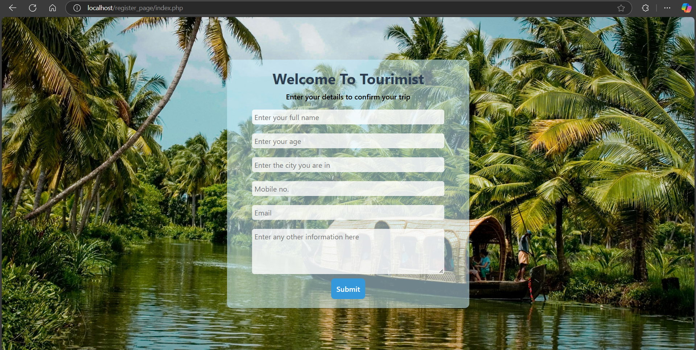
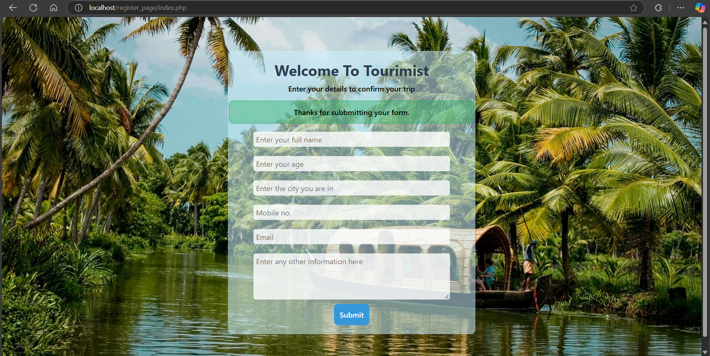

# Tourist Registration Webpage

A modern and user-friendly tourist registration form built with PHP and CSS.

## Overview

This project is a simple yet effective tourist registration system that allows users to submit their information for trip confirmation. The webpage features a clean, responsive design with a beautiful background image and smooth user interactions.

## Features

- Modern, responsive design
- User-friendly form interface
- Real-time form submission
- Success message notification
- Mobile-friendly layout
- Beautiful background image
- Smooth animations and transitions

## Technical Stack

- **Frontend:**
  - HTML5
  - CSS3 (with modern features like flexbox and transitions)
  - Responsive design principles

- **Backend:**
  - PHP
  - MySQL database

## Screenshots

### Initial Form View

*The initial view of the registration form with all input fields*

### After Submission

*The form view after successful submission with the success message*

## Setup Instructions

1. **Prerequisites:**
   - XAMPP (or similar local server environment)
   - Web browser
   - MySQL database

2. **Database Setup:**
   - Create a database named `tourism`
   - Use the following SQL command to create the required table:
   ```sql
   CREATE TABLE `tourism`.`user` (
       `id` INT NOT NULL AUTO_INCREMENT,
       `name` VARCHAR(100) NOT NULL,
       `age` INT NOT NULL,
       `city` VARCHAR(100) NOT NULL,
       `mobile` VARCHAR(20) NOT NULL,
       `email` VARCHAR(100) NOT NULL,
       `other` TEXT,
       `created_at` TIMESTAMP DEFAULT CURRENT_TIMESTAMP,
       PRIMARY KEY (`id`)
   );
   ```

3. **Installation:**
   - Clone or download this repository
   - Place the files in your XAMPP htdocs directory
   - Ensure the database connection details in `index.php` match your setup
   - Access the webpage through your local server (e.g., http://localhost/register_page)

## Form Fields

The registration form collects the following information:
- Full Name
- Age
- City
- Mobile Number
- Email Address
- Additional Information (optional)

## Styling Features

- Semi-transparent form container
- Smooth hover effects
- Focus states for input fields
- Responsive design for all screen sizes
- Professional color scheme
- Clear success message notification

## Browser Compatibility

The webpage is compatible with:
- Google Chrome
- Mozilla Firefox
- Microsoft Edge
- Safari
- Opera

## Security Considerations

- Basic form validation
- SQL injection prevention
- Input sanitization
- Secure database connection

## Future Improvements

Planned enhancements include:
- Enhanced form validation
- Email confirmation system
- User dashboard
- Admin panel
- Additional security features

## Contributing

Feel free to contribute to this project by:
1. Forking the repository
2. Creating a new branch
3. Making your changes
4. Submitting a pull request
